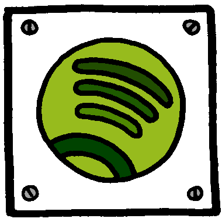

% Introduktion till FOSS
% N. Stenberg
% 11 april 2018

# Free and Open Source Software  -- \textbf{FOSS}

eller

Free, Libre and Open Source Software  -- \textbf{ FLOSS}

"Fri programvara" handlar om frihet, inte pris. För att förstå
begreppet, tänk "fri" som i "yttrandefrihet", inte som i
"kostnadsfri/gratis". 


# De fyra friheterna

-   \sg [frihet 0]\wi Friheten att köra programmet som du önskar, för ett
    godtyckligt syfte.
-   \sg [frihet 1]\wi Friheten att studera hur programmet fungerar och att
    anpassa det för sina behov. Tillgång till källkoden är
    ett villkor för detta.
-   \sg [frihet 2]\wi Friheten att vidaredistribuera kopior så att användaren
    kan hjälpa sin nästa.
-   \sg [frihet 3]\wi Friheten att förbättra programmet och att ge sina
    förbättringar till allmänheten så att hela samhället drar
    nytta. Tillgång till källkoden är ett villkor för detta.  

**Märk : Inget säger att man inte får tjäna pengar!**


# Starten:  MIT Media Lab


# Historia

- [-70th] Source code common way of distribution
- [70-80] Binärer började skickas ut
- [1983] IBM - Object code only
- [1983] Richard Stallman(RMS) : The GNU project
- [1984] GNU Operating System 
- [1985] Free Software Foundation FSF och the GNU Manifesto
- [1991] The Linux kernel
- [1998] Open Source Initiative (OSI) was formed
- [2013] Ubuntu Marks 'Bug No. 1' As Fixed. \textbf{Bug no. 1:}
    "Microsoft has a majority market share." 
- [2017] FOSS användning uppskattat till 94\% 


# Linux är ett FOSS-projekt och  har hållt på ett tag


# The Open Source Definition (by OSI)

1. Free Redistribution
2. Source Code
3. Derived Works
4. Integrity of The Author's Source Code
5. No Discrimination Against Persons or Groups
6. No Discrimination Against Fields of Endeavor
7. Distribution of License
8. License Must Not Be Specific to a Product
9. License Must Not Restrict Other Software
10. License Must Be Technology-Neutral


# FOSS är **VÄLDIGT** vanligt!

- Apache web server
- Content Managament Systems (tex swereas hemsida)
- I princip allt inom Molntjänster
- Nästan all IoT-devices
- Linux (Vanligaste OS-kärnan)
- .NET
- Firefox
- VLC
- MySQL
- MediaWiki (Wikipedia, virtwiki)
- Android


# Vad gör en programvara fritt?

\bco
\co

Licensen!

- GNU
	- GPL v2, v3
	- LGPL
- MIT
- BSD
- Apache
- Python
- CC
- Ett otal andra

\co


\eco

# Licensen säger hur du får använda programmet

\bco
\co

\red Förslag: \wi Läs EULA någon gång!

```

```

\sg FOSS licenser finns i två typer \wi

- Copyleft
	- typiskt GPL..
- eller
- "Gör vad du vill med texten"
	- typiskt  MIT och BSD

\co

{width=20mm}
{width=20mm}

{width=20mm}
{width=20mm}

{width=20mm}
{width=20mm}

\eco

# utdrag ur EULA : WINDOWS OPERATING SYSTEM July 2017

\scriptsize

**Restrictions.** The manufacturer or installer and Microsoft reserve all
rights (such as rights under intellectual property laws) not expressly
granted in this agreement. For example, this license does not give you
any right to, and you may not: 

1. use or virtualize features of the software separately;

2.  publish, copy (other than the permitted backup copy), rent, lease, or lend the software;

3.  transfer the software (except as permitted by this agreement);

4. work around any technical restrictions or limitations in the software;

5.  use the software as server software, for commercial hosting, make
    the software available for simultaneous use by multiple users over
    a network, install the software on a server and allow users to
    access it remotely, or install the software on a device for use
    only by remote users; 

6. reverse engineer, decompile, or disassemble the software, or
   attempt to do so, except and only to the extent that the foregoing
   restriction is (a) permitted by applicable law; (b) permitted by
   licensing terms governing the use of open-source components that
   may be included with the software; or (c) required to debug changes
   to any libraries licensed under the GNU Lesser General Public
   License which are included with and linked to by the software; and 

7. when using Internet-based features you may not use those features
   in any way that could interfere with anyone else's use of them, or
   to try to gain access to or use any service, data, account, or
   network, in an unauthorized manner. 


# Utdrag ur GPLv3

\scriptsize

2. Basic Permissions.

	All rights granted under this License are granted for the term of copyright
on the Program, and are irrevocable provided the stated conditions are met.
This License explicitly affirms your unlimited permission to run the unmodified
Program. The output from running a covered work is covered by this License
only if the output, given its content, constitutes a covered work. This License
acknowledges your rights of fair use or other equivalent, as provided by copyright
law.

	You may make, run and propagate covered works that you do not convey,
without conditions so long as your license otherwise remains in force. You
may convey covered works to others for the sole purpose of having them make
modifications exclusively for you, or provide you with facilities for running those
works, provided that you comply with the terms of this License in conveying all
material for which you do not control copyright. 


# Skillnad GPL och LGPL

## GPL

Programmet som byggs med GPL-kod förblir GPL-licensierat

## LGPL  (Lesser GPL)

Programmet som byggs med LGPL-kod behöver inte vara FOSS. LGPL-koden i
sig är dock alltid LGPL.


# Samma program kan ha flera licenser

Exempel:  **PyQt**

- Normalt **GPLv3**
	- Fritt, öppet, Behöver ej betala något
	- Används för att skapa GPLv3-icensierade program, som *FAME*
- Kan köpa kommersiell licens
	- kostar approx 300 Euro för ett år och en utvecklare
	- Utvecklarlicens ger **LGPL**
	- Kan då skapa slutna program


# Tankarna bakom FOSS

## Jag behöver denna funktion

## kanske andra också behöver den?

## Med FOSS-licens kan jag dela med mig och få ta del av andras tillägg

## Vi hjälper varandra


# FOSS som kan vara användbara:

- Octave
- Libre Office
- Python
- GIMP
- Blender
- 

# Annan viktig FOSS programvara

\bco

\co

- gcc
- gfortran
- och väldigt många andra kompilatorer
- GTK, Tk, Qt, \ldots

\co



Image by Jurgen Appelo - www.noop.nl
\eco


# Swerea KIMAB har utvecklat FOSS

## https://github.com/swerea

- FAME  (GPLv3)
	- använder:
		- CalculiX (GPLv2)
		- PyQt (GPLv3)
		- python3 (python lic)
		- stl-to-voxel (MIT lic)
- SPHgen (GPLv3)
	- använder:
		- python3 (python lic)
		- stl-to-voxel (MIT lic)


# Arbete pågår att stärka öppenheten

## T.ex: 

### Red Hat Press release March 19, 2018:

*CA Technologies, Cisco, HPE, Microsoft, SAP, and SUSE commit to
 providing a cure period for correcting license compliance issues in
 GPLv2 software* 


# Finns konferenser

- Varje större projekt har "sin" konferens
- Universella konferenser:
	- FOSDEM 
	- Libre Planet
	- ...


# Föredalar med FOSS

- Användning utan förbehåll
	- Installera, kör, använd alla CPUer du har
- Ofta användarutvecklat
	- Snabbt, direkt, enkelt
- Får använda som bas för egna program
	- Snabbare utveckling
- Får skriva om efter eget huvud.
	- Kustomisering
- Ingen försöker aktivt hindra dig


# Varför är FOSS SÅ populärt som det är?

- Frihet
- Kontroll
- Kostnad
- "Community"


# Varför är FOSS SÅ populärt som det är?

## Jim Whitehurst, CEO  Red Hat:

*"About five or six years ago, something changed. Large corporations,
including Google and Facebook, started open sourcing their own
projects because they didn't look at some of the infrastructure
technologies they opened up as competitive advantages. Instead, having
them out in the open allowed them to profit from the ecosystems that
formed around that."*


# Vad är FOSS community?

- **Personerna som hjälper utvecklingen**
	- Programmerare
	- Dokumentatörer

	*De förbättrar hela tiden*

- **Användare**
	- Bugg-rapportörer
	- Feedback

	*De svarar på användarfrågor*


# Som exempel: Blender communities


# Mer Blender : Utveckling


# Använd FOSS!

Använd **INTE** \sg *Freeware!* \wi - Ofta skadliga program!


# Tack för att ni lyssnade

{height=50mm}

Ett tips: lägg till *gpl* när ni söker program för att hitta FOSS

