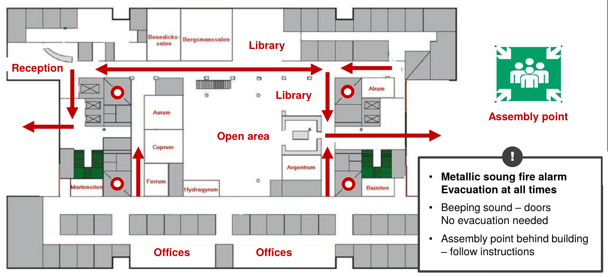

% Välkomna till FOSS för beräkningsingenjörer
% N. Stenberg, F. Wredenberg, A. Delic
% 11 april 2018

# Vid evakuering

# Kunskaper vid kursens slut

- Känna till ett urval av öppna verktyg inom ramen för FE-analyser
- Förstå tankarna bakom existensen av öppen och fri programvara(FOSS)
- Förstå fördelar och nackdelar med FOSS
- Vet var programvara finns att tillgå
- Vet var hjälp runt FOSS finns att hämta
- Ha använt ett urval av öppna verktyg

# Ingår i kursavgift

- 2 dagar kurs
- Lunch båda dagarna
- Fika 2 ggr per dag
- 1 Middag
- 1 USB-sticka med kursmijlö,  programvara och dokumentation

# Vi som håller i kursen är:

Namn   |  mejl
---:   | ---
Niclas Stenberg    | [niclas.stenberg@swerea.se](mailto:niclas.stenberg@swerea.se)
Fredrik Wredenberg | [fredrik.wredenberg@swerea.se](mailto:fredrik.wredenberg@swerea.se)
Aldin Delic       | [aldin.delic@swerea.se](mailto:aldin.delic@swerea.se)

# Agenda  Dag 1   (10-18)

-  09-10 : Kaffe och uppsamling
-  10-12 : Introduktion till FOSS
	- licenser
	- tankar bakom existensen av FOSS
	- exempel
-  12-13 : Lunch
-  13-15 : Start och information av kursmiljö
	- start av USB på medhavd eller lånad dator
	- Linux intro & genomgång av miljön
-  15-16 : Kaffe och telefonstund
-  16-18 : Översikt och användning av programvara
	- Programmen i kursen
	- filformat
	- CAD-verktyg med övning

Middag

# Agenda Dag 2  (8-16)

-  08-15 : Aktivt arbete på befintlig geometri
	- Meshning, beräkning och resultatanalys med olika FOSS program
		1. Kort visning
		2. Söka i dokumentation
		3. Prova själv
-  12-13 : Lunch
-  13-14 : Info: Delning av beräkning
	- en fördel med FOSS
	- utvecklingsmodell
	- Var hittar man programvaran
	- Services som finns att tillgå
-  15-16 : Sammanfattning och avslutning

# Kursmaterial

[https://github.com/swerea/kursFOSS](https://github.com/swerea/kursFOSS)

