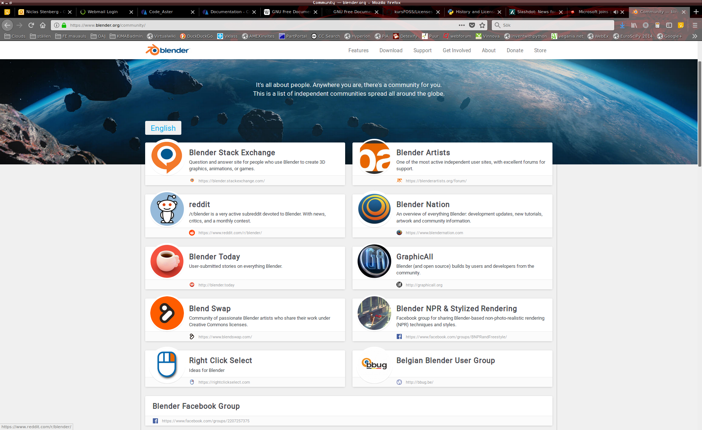
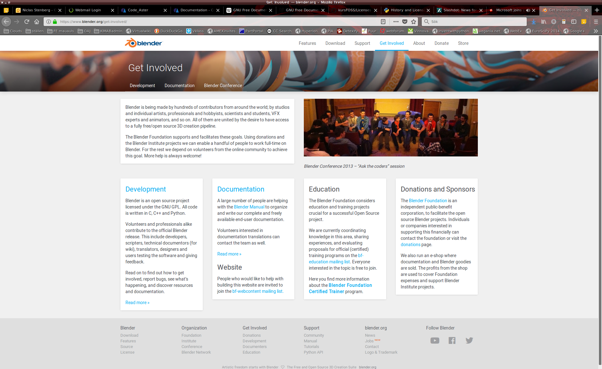
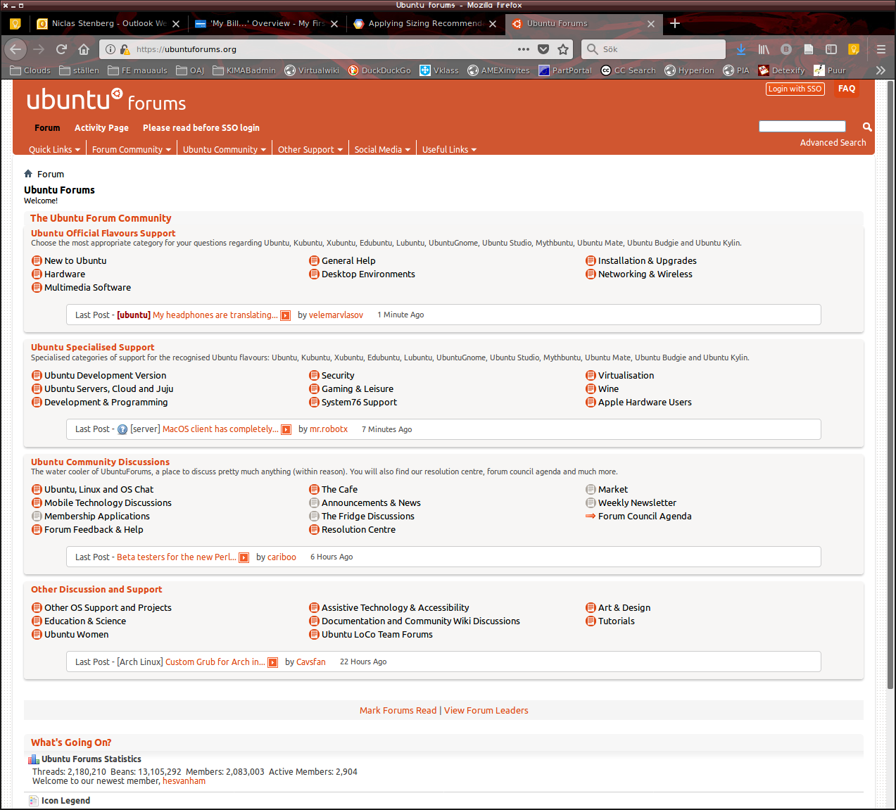

% FOSS och hur världen finns där ute och delar med sig
% N. Stenberg
% 12 april 2018

# Denna timme

- FOSS utvecklingsmodell
- Hur får man tag på hjälp?
- Hur bidrar man?
- Var hittar man programvaran
- Services som finns


# FOSS utvecklingsmodell - förutsättningar

\bco
\co

- Antalet utvecklare varierar
- Inget kontor
- Inga fasta arbetstider
- Deltagare från hela världen

\co


\eco


# FOSS utvecklingsmodell - påverkar framtiden

\bco
\co

- Antalet utvecklare varierar
- Inget kontor
- Inga fasta arbetstider
- Deltagare från hela världen

\co

Har påverkat dagens företag

- \sg Detta har lett till en arbetsmetodik som även annan typ av
utveckling använder\wi
- \sg Det har också lett till att ledarfunktionen i organisationer ändras\wi
- \sg i.e. Självstyrande organisationer\wi

\eco


# FOSS utvecklingsmodell  (varierar otroligt!!)

Generiskt för ett projekt:

- Alla kan delta
	- bara att anmäla sig
- Det finns regler
	- "Code of conduct"
- Executiv "ledning"
	- Röstas fram, eller de som håller i idén
- Många företag har sina anställda att skriva FOSS kod.
- Har ofta buggrapportering från användare (inbyggd)
- Gemensam versionshantering
- Mejllistor
- Chat: IRC hyfsat vanligt
- Allt är öppet


# FOSS utveckling

- Används i många projekt för att det är effektivt

För personer:

- Vill ni koda så gör det!!
- Ofta eftersöks dokumentatörer


# Hjälp med FOSS frågor

- Sökmotor: google, duckduckgo et dyl.
	- Ubuntu forum
	- Arch linux forum
- Online documentation
- Mejllistorna till det programmet
- Chatkanaler för programmet
- Browsa gamla poster
	- gamla svar, mejllistor
- Betala support


# Vi hjälper varandra


# En kommentar om FOSS

## Företag bestämmer sig för licensiera deras program som FOSS för att:

- De tjänar på det
- eller förlorar inte så mycket...
- De vill ha kontakt med "community"


# Vad är FOSS community?

- **Personerna som hjälper utvecklingen**
	- Programmerare
	- Dokumentatörer

	*De förbättrar hela tiden*

- **Användare**
	- Bugg-rapportörer
	- Feedback

	*De svarar på användarfrågor*


# Som exempel: Blender communities



# Mer Blender : Utveckling




# Ubuntu forum




# För FOSS-ingenjören

## CalculiX:

\sg mejllista: \wi

[http://groups.yahoo.com/group/calculix](http://groups.yahoo.com/group/calculix) 

## Salome - Code Aster:

\sg Forum: \wi

[https://www.code-aster.org/forum2/](https://www.code-aster.org/forum2/)


# Var finns all FOSS?


# Var finns all FOSS?

## Om linux distro används:

- I "Repositories"
	- strukturerade databaser för distron

\sg eller i:\wi

- tilläggsrepositories
	- databaser som har samma struktur som den officiella


# Var finns all FOSS?

## Större projekt:

- På respektive sida
	- Både binärer och källkod
- Exempel
	- [Blender](https://www.blender.org/download/)
	- [GIMP](https://www.gimp.org/downloads/)
	- [Octave](https://www.gnu.org/software/octave/#install)


# Var finns all FOSS?

## Versionshanteringssiter

- github.com
- sourceforge.net
- savannah.gnu.org

ofta hämta hem källkoden och kompilera

## Annars

- ostrukturerat:
	- så sök!

\red Ett tips\wi : lägg till *GPL* när ni söker program för att hitta FOSS


# Services som finns där ute

Tjänster som kan användas där FOSS för beräkningsingenjörer har en
stor del.

# Services som finns där ute

## Services som härstammar från EU-projekt

- Fortissimo:  [https://www.fortissimo-project.eu/](https://www.fortissimo-project.eu/)
	- Buying Services (betala användande per timme)
	- Knowledge Database  (dokumentation)
	- Domain Experts (det det låter som)
- cloudSME:  [http://www.cloudsme-apps.com/](http://www.cloudsme-apps.com/)
	- Platform as a Service (PaaS)
	- Software as a Service (SaaS) 
		- CalculiX, OpenFOAM, ...
	
# Sedan så: ... såklart ...

- Amazon Web Service (AWS)
	- Elastic Cloud 2
- Google Cloud 
	- Compute Engine (Virtual Machines)
- Microsoft Azure
	- Virtual Machines

\sg Kostnad (Ubuntu, standard tidsbaserad):\wi  

- 64 kärnor approx: $4/timme
- 16 kärnor approx: $1/timme


# Rent praktiskt: Varje tjänst har sin miljö

Det finns att ladda ner:

- För Amazon Web Service (AWS)
	- `aws`
- För Google Cloud
	- `gcloud`
- För Azure
	- `vet ej`

Annars så funkar browsern och `ssh` bra, dock utan
automatiseringsmöjligheter. 


# Användning:

1. Skapa konto
2. Starta en "instance"
3. Flytta över binär och input-fil
4. kör!

# Användning:

Skriv ett script som

- startar önskad instans
- flyttar över motor och input-fil
- startar
- flyttar tillbaka när klart
- stänger instans

sedan kör:

`$>: ccxAWS simfil.inp`


# ccxAWS

\scriptsize

```bash
#! /bin/bash
# Only works for t2.micro AWS instances (1 cpu and free tier)
export AWS_DEFAULT_OUTPUT="text"
ID=$(aws ec2 describe-instances --filters "Name=instance-type,Values=t2.micro" --query Reservations[].Instances[].InstanceId)
STATE=$(aws ec2 describe-instance-status --instance-ids $ID --query InstanceStatuses[].InstanceState[].Name)
if [[ -z $STATE ]]; then
    aws ec2 start-instances --instance-ids $ID
fi
# create something to run  (copy ccx and make executable)
scp -i /home/$USER/.ssh/EUcentralKIM.pem /home/$USER/aws/ccx \
    ubuntu@ec2-xx-xxx-xxx-xxx.eu-central-1.compute.amazonaws.com:
ssh -i /home/$USER/.ssh/EUcentralKIM.pem ubuntu@ec2-xx-xxx-xxx-xxx.eu-central-1.compute.amazonaws.com \
    'chmod 755 ccx'
# copy the file and run
scp -i /home/$USER/.ssh/EUcentralKIM.pem $1 ubuntu@ec2-xx-xxx-xxx-xxx.eu-central-1.compute.amazonaws.com:inpFile.inp
ssh -i /home/$USER/.ssh/EUcentralKIM.pem ubuntu@ec2-xx-xxx-xxx-xxx.eu-central-1.compute.amazonaws.com \
    'bash -s' <<'ENDSSH'
    # OMP_NUM_THREADS=64
    # export OMP_NUM_THREADS
    ./ccx inpFile
ENDSSH
```


# Sammanfattning


- Det viktigaste med FOSS är användarna
	- De ger feedback på användningen
	- De ger hjälp vid frågor
	- De skapa användardokumentation - manualer, tutorials, etc.
- Hjälp vid frågor
	- mejllistor, chat  --  både gamla och nya
	- Köpt support
- Programmen finns på nätet
	- Ofta binärer, men nästan alltid källkod
- FOSS passar bra för molntjänster
	- Inga konstiga licensvillkor


