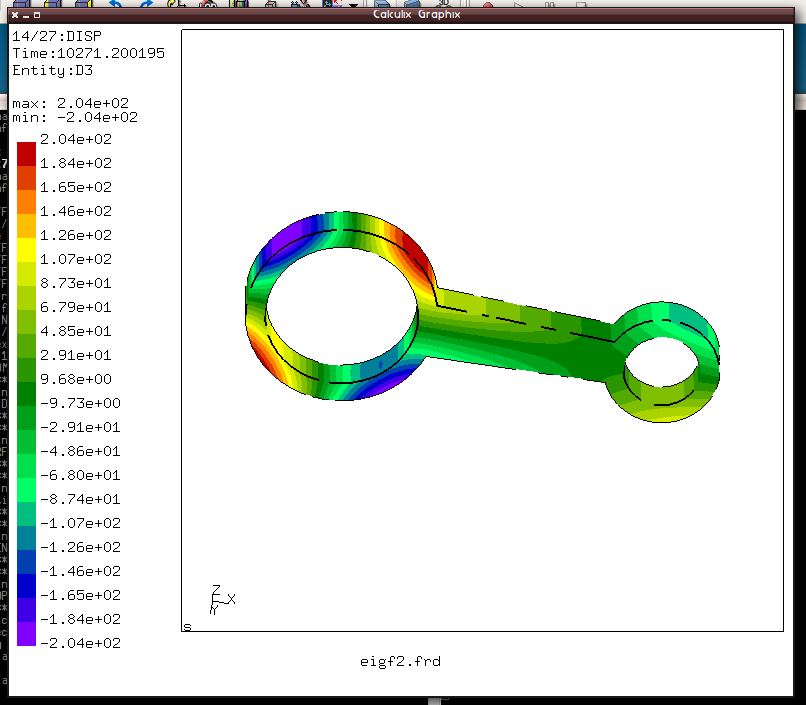

% Egenfrekvensanalys med Salome och calculix
% N. Stenberg
% 12 april 2018


# Har geometrin - Importera till salome


# konvertera till solid

STL är en yta, för att kunna 3D-mesha behövs en solid:


# Så meshning

Över i mesh modulen och börja mesha


# Välj solid


# Netgen behöver parametrar


# Skapa meshet


# Exportera mesh

- UNV för att konvertera senare
- eller:

```
>>>execfile(r"/home/niclas/src/SalomeToCalculix/SalometoCalculix.py")
```
	  

# Gör en input-fil till ccx

\scriptsize

```
*Heading
**
*INCLUDE, INPUT=meshcal2.inp
** 
** MATERIALS
** 
*Material, name=Mat
*Density
 7.8e-09,
*Elastic
210000., 0.3
*SOLID SECTION,MATERIAL=MAT,ELSET=C3D10
** 
** STEP: cycle
** 
*Step, perturbation
*Frequency
30
*NODE FILE
U
*EL FILE
S
*END STEP
```

# Kör sim

```
$: ccx inputfil
```


# Kolla dat-fil

\scriptsize

```
 MODE NO    EIGENVALUE                       FREQUENCY   
                                     REAL PART            IMAGINARY PART
                           (RAD/TIME)      (CYCLES/TIME     (RAD/TIME)

      1  -0.1438755E-02   0.0000000E+00   0.0000000E+00   0.3793092E-01
      2  -0.4535929E-03   0.0000000E+00   0.0000000E+00   0.2129772E-01
      3  -0.2640621E-03   0.0000000E+00   0.0000000E+00   0.1624999E-01
      4  -0.2478882E-04   0.0000000E+00   0.0000000E+00   0.4978837E-02
      5   0.2998733E-03   0.1731685E-01   0.2756062E-02   0.0000000E+00
      6   0.4849564E-03   0.2202173E-01   0.3504866E-02   0.0000000E+00
      7   0.2270311E+09   0.1506755E+05   0.2398075E+04   0.0000000E+00
      8   0.2649968E+09   0.1627872E+05   0.2590839E+04   0.0000000E+00
      9   0.1003054E+10   0.3167103E+05   0.5040600E+04   0.0000000E+00
     10   0.1004005E+10   0.3168604E+05   0.5042990E+04   0.0000000E+00
     11   0.1430309E+10   0.3781942E+05   0.6019148E+04   0.0000000E+00
     12   0.1814849E+10   0.4260105E+05   0.6780168E+04   0.0000000E+00
     13   0.3361090E+10   0.5797490E+05   0.9226993E+04   0.0000000E+00
     14   0.4205204E+10   0.6484754E+05   0.1032081E+05   0.0000000E+00
     15   0.4374527E+10   0.6614021E+05   0.1052654E+05   0.0000000E+00
     16   0.7645418E+10   0.8743808E+05   0.1391620E+05   0.0000000E+00
     17   0.1067993E+11   0.1033438E+06   0.1644767E+05   0.0000000E+00
     18   0.1081857E+11   0.1040124E+06   0.1655408E+05   0.0000000E+00
     19   0.1424225E+11   0.1193409E+06   0.1899370E+05   0.0000000E+00
     20   0.1743847E+11   0.1320548E+06   0.2101717E+05   0.0000000E+00
     21   0.1884385E+11   0.1372729E+06   0.2184766E+05   0.0000000E+00
     22   0.2383453E+11   0.1543844E+06   0.2457103E+05   0.0000000E+00
     23   0.2780325E+11   0.1667431E+06   0.2653798E+05   0.0000000E+00
     24   0.2884252E+11   0.1698309E+06   0.2702942E+05   0.0000000E+00
     25   0.3063688E+11   0.1750339E+06   0.2785751E+05   0.0000000E+00
     26   0.3423316E+11   0.1850220E+06   0.2944717E+05   0.0000000E+00
     27   0.4371793E+11   0.2090883E+06   0.3327744E+05   0.0000000E+00
     28   0.4612959E+11   0.2147780E+06   0.3418298E+05   0.0000000E+00
     29   0.4722248E+11   0.2173073E+06   0.3458554E+05   0.0000000E+00
     30   0.5095400E+11   0.2257299E+06   0.3592604E+05   0.0000000E+00
```

# Kolla med CGX

```
$: cgx inputfil.frd
```


# Typisk bild



